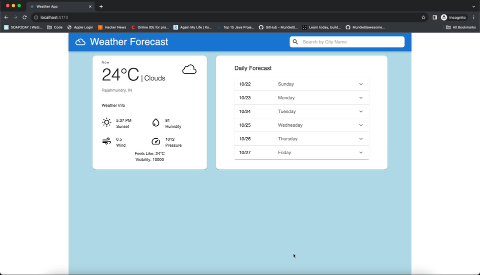

## React Weather App

React Weather App is developed using **React + TypeScript + Vite + OpenWeatherMapAPI**.

User can search a city by name and can see the current weather details of the city (like temperature in celsius, weather description, sunset time, humidty, wind speed, pressure, feels_like, visibility etc) and 5 days weather forecast with 3-hour step.

## Technologies Used

### [Vite](https://vitejs.dev/)
- Provides Fast build times and instant updates to the browser.
- Reduces the time spent on building and deploying applications.
- The built-in development server in Vite is optimized for fast reloading and hot module replacement, allowing developers to see the changes they make to their code in real-time without the need for a full page refresh.
- Optimized code sizes using lazy loading, code-splitting and tree-shaking features.

### [OpenWeatherMapAPI](https://openweathermap.org/)
Provides API's related to weather forecasts, nowcasts and history in a fast and elegant way.

#### API's Used
- **Current Weather:** 
   - **Method**: `GET`
   - **URL**: `https://api.openweathermap.org/data/2.5/weather?appid={API_KEY}&units=metric&q={city_name}`
- **3-hour Forecast 5 days:**
   - **Method**: `GET`
   - **URL**: `https://api.openweathermap.org/data/2.5/forecast?q={city_name}&appid={API_KEY}&units=metric`

#### [Material UI](https://mui.com/material-ui/react-autocomplete/)
Provides suite of ready to use Material Design components and customization options that make it easy to implement your own custom design system.

## Installation and Usage
To use this app, follow these steps:
- Clone the repository or download the source code.
- Open the project in your preferred code editor.
- Run `npm install` to install all the necessary dependencies.
- Run `npm run dev` to start the development server on `http://localhost:5173/`.
- Run `npm run test` to run the unit tests.

To use the app, simply type the name of the city you want to search for in the search bar and press Enter. The app will display the current weather conditions for the searched city.

